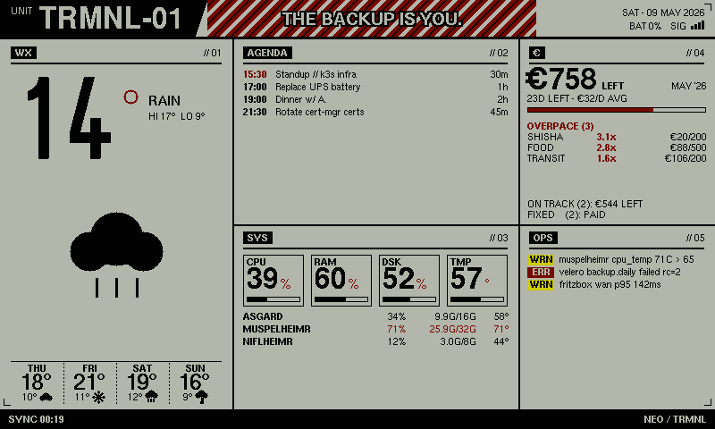

# TRMNL//CYBERPUNK

A self-hosted [TRMNL](https://usetrmnl.com/) BYOS (Bring Your Own Server) dashboard for the Seeed e1002 800×480 Spectra 6-color e-ink display.

The server renders the dashboard pixel-by-pixel in Rust (`embedded-graphics` + u8g2 bitmap fonts) into a 4-bit indexed PNG using the panel's measured 6-color palette, then serves it to the device. No browser, no fonts on disk, no template files.



*Mock-data render — produced by `RENDER_TO=dashboard.png cargo run`. Colors look muted on a normal monitor because the PNG palette uses the panel's actual measured ink RGB values, not vivid sRGB equivalents.*


---

## Features

- Full TRMNL BYOS protocol — `/api/setup`, `/api/display`, `/api/log`
- Battery % and RSSI from the device are shown in the dashboard header
- 4-bit indexed PNG output: every pixel is exactly one of the six panel inks (no dithering, no antialiasing) so the panel renders what we drew
- Pluggable upstreams: Prometheus + Alertmanager, Nextcloud CalDAV, ActualBudget, Open-Meteo. Mock fallbacks for everything when env vars are blank
- Norse-mythology mock hostnames, multi-day weather, calendar agenda, budget categories, alert feed

### Dashboard panels

| Column | Width | Panels |
|---|---|---|
| Left | 260 px | WX (current temp + 4-day forecast, full height) |
| Middle | 320 px | AGENDA (top) · BUDGET (bottom) |
| Right | 220 px | SYS — hosts (top) · OPS — alerts (bottom) |

### Color palette — Spectra 6-color e-ink

The panel uses six fixed inks. The values below are the *measured* on-panel RGB values (from the firmware's calibration table), which is what we encode into the PNG palette. They look muted/olive on a normal monitor but accurately preview what the panel actually shows.

| Role | Color |
|---|---|
| Background | `#020202` black |
| Body / fills | `#b3b6ab` "white" |
| Headers / accent | `#002f6b` blue |
| Warnings / temperature | `#cdca00` yellow |
| Errors / critical bars | `#750a00` red |
| OK / good bars | `#214528` green |

---

## Quick start (Docker Compose)

```bash
git clone https://github.com/DiverOfDark/trmnl-cyberpunk
cd trmnl-cyberpunk

# Edit BASE_URL to your machine's LAN address so the device can reach it
docker compose up -d

# Preview in browser
open http://localhost:8080/dashboard.png

# Force an immediate upstream re-fetch
curl http://localhost:8080/refresh
```

### Environment variables

| Variable | Default | Description |
|---|---|---|
| `BASE_URL` | `http://localhost:8080` | Public URL the TRMNL device uses to fetch the PNG |
| `REFRESH_SECS` | `3600` | Upstream-refetch interval, also reported to the firmware as its poll cadence (seconds) |
| `TRMNL_API_KEY` | `cyberpunk-byos` | API key returned to the device on `/api/setup` |
| `LISTEN` | `0.0.0.0:8080` | Bind address |
| `RUST_LOG` | `trmnl_cyberpunk=info` | Log level |
| `LOCAL_MODE` | _(unset)_ | If set, never fetch upstreams — serve mock data only |
| `RENDER_TO` | _(unset)_ | If set to a path, render one PNG with mock data, write it, and exit |

Upstream-specific env vars (leave blank to use the matching mock data) are documented in `docker-compose.yml`.

---

## Kubernetes (Helm)

```bash
helm install trmnl-cyberpunk \
  oci://ghcr.io/diverofdark/charts/trmnl-cyberpunk \
  --set baseUrl=http://192.168.1.x:8080 \
  --set trmnlApiKey=your-secret-key
```

Key values:

```yaml
baseUrl: "http://192.168.1.x:8080"   # reachable from the TRMNL device
refreshSecs: "3600"
trmnlApiKey: "your-secret-key"
image:
  tag: "main"                          # or a semver tag like "0.1.0"
```

---

## Render pipeline

```
Device  →  GET /api/display  →  stores battery + rssi
                                returns dashboard PNG URL
                                  (BASE_URL/dashboard/{epoch})

Per-request render (every device fetch):
  1. clone the latest fetched data
  2. re-stamp clock-derived fields (time, date, motto, sync markers)
  3. draw straight into an 800×480 indexed framebuffer
  4. encode as 4-bit indexed PNG with the panel palette
  5. bump last_render_at → /api/display URL gets a new {epoch} suffix,
     defeating the firmware's 24h dedupe cache
```

A background task refetches upstreams every `REFRESH_SECS` (first run fires 500 ms after startup). Concurrent upstream fetches are deduped via a mutex; the render itself is per-request and never cached server-side.

---

## Customising the dashboard

The entire visual design lives in two files:

- `src/render.rs` — the indexed-color canvas, palette, and pixel primitives
- `src/dashboard.rs` — panel layout, fonts, and per-section rendering

There is no HTML template — every shape on the panel is drawn by Rust code. To preview a change locally without a device:

```bash
RENDER_TO=/tmp/dash.png cargo run
open /tmp/dash.png
```

To add a real data source, extend `Sources::fetch` in `src/fetch.rs`. The mock data in `DashData::mock()` (in `src/data.rs`) is the fallback whenever an upstream's env vars are unset or the fetch fails.

---

## Endpoints

| Method | Path | Description |
|---|---|---|
| `GET` | `/api/setup` | TRMNL device provisioning |
| `GET` | `/api/display` | TRMNL device poll — returns image URL |
| `POST` | `/api/log` | TRMNL device diagnostic logs |
| `GET` | `/dashboard.png` | Rendered fresh on every request (no cache) |
| `GET` | `/dashboard/{epoch}` | Same handler; `{epoch}` is the cache-buster the firmware sees |
| `GET` | `/refresh` | Force an immediate upstream re-fetch |
| `GET` | `/health` | Health check |

---

## Development

```bash
# Run locally
cargo run

# Open dashboard preview
open http://localhost:8080/dashboard.png

# One-shot render (no server)
RENDER_TO=/tmp/dash.png cargo run
```

No system dependencies beyond a Rust toolchain — fonts are bundled into the `u8g2-fonts` crate, and the renderer writes PNGs directly via the `png` crate.

---

## CI/CD

GitHub Actions (`.github/workflows/ci.yml`):

1. **test** — `cargo check`, `clippy -D warnings`, `cargo test`
2. **docker** — builds and pushes to `ghcr.io/diverofdark/trmnl-cyberpunk` with tags `main`, `sha-<hash>`, and semver on `v*` tags
3. **helm** — packages and pushes the chart to `oci://ghcr.io/diverofdark/charts/trmnl-cyberpunk`

Tag a release to get pinned versioned artifacts:

```bash
git tag v0.2.0 && git push origin v0.2.0
```
