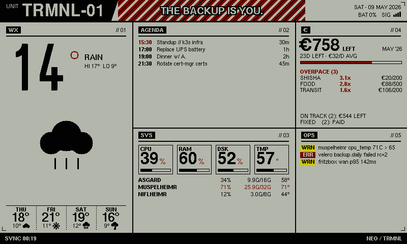
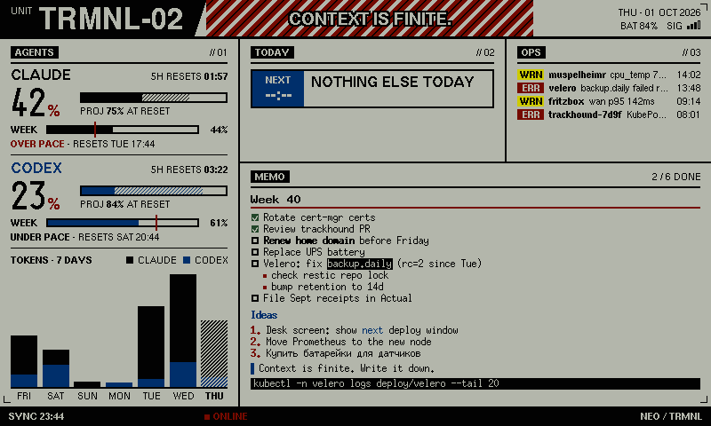

# TRMNL//CYBERPUNK

A self-hosted [TRMNL](https://usetrmnl.com/) BYOS (Bring Your Own Server) dashboard for the Seeed e1002 800×480 Spectra 6-color e-ink display.

The server renders the dashboard pixel-by-pixel in Rust (`embedded-graphics` + u8g2 bitmap fonts) into a 4-bit indexed PNG using the panel's measured 6-color palette, then serves it to the device. No browser, no fonts on disk, no template files.



*Mock-data render — produced by `RENDER_TO=dashboard.png cargo run`. Colors look muted on a normal monitor because the PNG palette uses the panel's actual measured ink RGB values, not vivid sRGB equivalents.*


---

## Features

- Full TRMNL BYOS protocol — `/api/setup`, `/api/display`, `/api/log`
- The device's name (set on `/devices`), battery % and RSSI are shown in the header
- 4-bit indexed PNG output: every pixel is exactly one of the six panel inks (no dithering, no antialiasing) so the panel renders what we drew
- Pluggable upstreams: Prometheus + Alertmanager, Nextcloud CalDAV, ActualBudget, Open-Meteo, [trackhound](https://github.com/DiverOfDark/trackhound). Mock fallbacks for everything when env vars are blank
- Memo screen: write markdown in a WYSIWYG web editor at `/`; it autosaves to disk and the device shows it on its next wake-up
- Desk screen: Claude and Codex rate limits, a GitHub contribution heatmap, today's events and alerts, and the memo across the bottom
- Multiple devices: `/devices` lists every panel with its last battery, signal, firmware and check-in time, and assigns each one the dashboard, the memo or the desk screen
- Norse-mythology mock hostnames, multi-day weather, calendar agenda, budget categories, alert feed

### Dashboard panels

| Column | Width | Panels |
|---|---|---|
| Left | 260 px | WX (current temp, next 6 hours, 8-day forecast, full height) |
| Middle | 320 px | AGENDA (top) · BUDGET (bottom) |
| Right | 220 px | SYS — hosts (top) · OPS — alerts (bottom) |

### Color palette — Spectra 6-color e-ink

The panel uses six fixed inks. The values below are the *measured* on-panel RGB values (from the firmware's calibration table), which is what we encode into the PNG palette. They look muted/olive on a normal monitor but accurately preview what the panel actually shows.

| Role | Color |
|---|---|
| Background | `#020202` black |
| Body / fills | `#b3b6ab` "white" |
| Headers / accent | `#002f6b` blue |
| Warnings / temperature | `#cdca00` yellow |
| Errors / critical bars | `#750a00` red |
| OK / good bars | `#214528` green |

---

## Quick start (Docker Compose)

```bash
git clone https://github.com/DiverOfDark/trmnl-cyberpunk
cd trmnl-cyberpunk

# Edit BASE_URL to your machine's LAN address so the device can reach it
docker compose up -d

# Preview in browser
open http://localhost:8080/dashboard.png

# Force an immediate upstream re-fetch
curl http://localhost:8080/refresh
```

### Environment variables

| Variable | Default | Description |
|---|---|---|
| `BASE_URL` | `http://localhost:8080` | Public URL the TRMNL device uses to fetch the PNG |
| `REFRESH_SECS` | `3600` | Poll cadence reported to the firmware (seconds) |
| `FETCH_INTERVAL_SECS` | `300` | How often the background task refetches upstreams (seconds). Independent of the device's poll cadence |
| `FETCH_TIMEOUT_SECS` | `45` | Per-source ceiling on one upstream pull; a source that overruns keeps its last values and is marked stale |
| `TRMNL_API_KEY` | `cyberpunk-byos` | API key returned to the device on `/api/setup` |
| `LISTEN` | `0.0.0.0:8080` | Bind address |
| `RUST_LOG` | `trmnl_cyberpunk=info` | Log level |
| `LOCAL_MODE` | _(unset)_ | If set, never fetch upstreams — serve mock data only |
| `RENDER_TO` | _(unset)_ | If set to a path, render one PNG with mock data, write it, and exit |
| `DATA_DIR` | `./data` (`/data` in the image) | Where the memo (`note.md`) and device settings (`devices.json`) are stored. Mount a volume here |
| `GITHUB_USER` | _(unset)_ | Desk screen: GitHub account whose contribution heatmap is shown |
| `FIRMWARE_UPDATE` | _(on)_ | Set to `false` to stop offering the bundled firmware as an OTA update |
| `FIRMWARE_MODEL` | `reterminal_e1002` | Device `Model` header the bundled firmware is offered to |
| `FIRMWARE_DIR` | `/app/firmware` | Directory with `firmware.bin` + `version.txt` |

Upstream-specific env vars (leave blank to use the matching mock data) are documented in `docker-compose.yml`.

### The budget panel

The hero is **safe-to-spend per day**: what's left across the day-to-day envelopes divided by the days until payday. Payday is derived from when large inflows have actually landed over the last three months — a salary paid on the last working day is recognised as month-end rather than pinned to a date that drifts.

Beside it, **how this month compares with the last three**, measured at the same day of the month so it's like for like, and reduced to a verdict: `OVER USUAL`, `ON USUAL`, or `UNDER USUAL`. The euro figure and the two numbers behind it were accurate but cost three of the panel's eight lines; direction is what a glance actually uses, and the envelope rows below say where it's coming from. The word `USUAL` appears in every variant because "over" alone doesn't say over *what*. A delta inside ±€25 reads as on-pace, since naming rounding noise invites false precision. Savings goals are excluded from both sides — money moved into a goal is allocation, not consumption, and one lumpy investment transfer would otherwise swamp the comparison. Nothing is shown before the 3rd of the month, when the baseline is still one or two bills.

This replaced a spent-vs-budget pace bar. Budgets tend to be set below what a category actually costs, so measuring against them mostly reported that the budget was wrong; measuring against recent behavior reports whether *this* month is different, which is the question worth a wall panel.

Then **total capital** — on-budget cash plus off-budget holdings — over roughly twelve month-ends, read from Actual's `balancehistory` endpoint (one small request per account, no transaction arithmetic). Transfers between your own accounts cancel out by construction, so this line is immune to the accounting artifacts that distort income-vs-spend charts.

It is a line, not bars, and deliberately so. The series sits in a narrow band far from zero. A bar encodes quantity as *length*, so it carries an implicit zero and truncating its axis lies — drawn honestly from zero, a 30% move compresses into the top quarter and every bar looks identical. A line encodes quantity as *position*, where a truncated axis is conventional and readable; the absolute value and the year delta are printed alongside so the missing baseline can't mislead. The final segment is dashed because the month in progress is pre-payday for most of its length, and that predictable dip shouldn't read as a real decline.

At most two envelopes are flagged, and only for two reasons:

- **OUT** — Actual's `balance` (carryover + budgeted − spent) is already negative, i.e. genuinely out of money. Using `balance` rather than `cap − spent` means an envelope that overshot this month but is still covered by accumulated funds isn't flagged. (Named `OUT` rather than `OVER` so it doesn't collide with the month verdict above.)
- **HOT** — spending is ≥40% above *this envelope's own* median spend by this same day-of-month over the prior three months, by at least €25, from the 4th of the month onward. Comparing an envelope to its own history catches a change in behavior; comparing it to a budget only catches an envelope that was set too low.

The panel carries no month label: the dashboard header two panels over already shows the full date.

Classification matches the Actual category *group* name against `ACTUALBUDGET_FIXED_GROUPS` / `ACTUALBUDGET_VARIABLE_GROUPS` / `ACTUALBUDGET_SAVINGS_GROUPS` (comma-separated, case-insensitive substrings; sensible English defaults built in), falling back to a per-category transaction-count heuristic when a group name is unrecognized. Income groups are skipped so inflows don't pollute the spend rollups.

### The memo screen

Open the server's root URL (`/`) in a browser and write. The editor is WYSIWYG (Toast UI, loaded from its CDN) and saves the markdown on every pause in typing — there is no save button. Beside it (or above, on narrower windows) is the panel itself: the exact PNG the device will download, at its native 800×480 with no smoothing, refreshed after every save. A toggle switches the preview to the dashboard. The REST API is documented at `/swagger`. The note is written to `$DATA_DIR/note.md`, so it survives restarts and can be edited with plain tools too.

Which devices show the memo is set per device on the devices page (below); a device assigned to it shows the memo on every wake-up, and its empty state while there is none.

The memo is fitted, not scrolled. It's set in the largest of five type sizes that holds the whole note, from Inconsolata 24 for a few lines down to 7×13 for a page of text; anything longer is cut at the last whole line with a red `MORE IN EDITOR` tag. Headings, bold, emphasis (blue), strikethrough, inline and block code, quotes, rules, links, bullet/numbered lists and task lists render. Tables are drawn one row per line. Latin, € and Cyrillic are covered; typographic dashes and quotes fold to ASCII, and other glyphs (emoji) print as `?`.

### The desk screen



Assign **DESK** to a panel on `/devices`, or preview it at `/desk.png`. It's built for a panel on a work desk:

- **AGENTS** — for Claude and Codex each: the 5-hour session window as a big percent, with a hatched tail showing where it ends up at the current rate (`PROJ`); the weekly window with a red tick at even pace, and an `OVER PACE` / `ON PACE` / `UNDER PACE` verdict (±5 points). A spent window turns into a red `LIMITED · BACK 16:40`. Below, the GitHub contribution heatmap.
- **TODAY** — the next timed event and how long until it, then the rest of today's events one line each, all-day events last.
- **OPS** — the same Alertmanager alerts as the dashboard, errors first: what fired in bold, then where and since when. The header counts everything firing (`2 ERR · 3 WRN`), so alerts that don't fit still register.
- **MEMO** — the memo across the full width under those two, with a `2 / 7 DONE` count when it has task-list items. It's fitted like the memo screen but starts at the 9×15 face, stepping down to 8×13 and 7×13 for longer notes, so it reads as a list rather than a poster.

**Rate limits** come from the same endpoints the CLIs use for `/usage`. Sign the server in on **`/agents`** (linked from the editor and devices pages):

- **Claude** — *SIGN IN* opens Claude's consent page in a new tab. Approve, copy the code it shows, paste it back. The server asks only for `user:profile user:inference`.
- **Codex** — *SIGN IN* shows a code; enter it at `auth.openai.com/codex/device`. The page notices the approval by itself.

Each is a login of the server's own, separate from any CLI session, so neither logs the other out. Tokens are kept in `$DATA_DIR` (`claude-credentials.json`, `codex-auth.json`) and refreshed when they run out — so `$DATA_DIR` must persist (a volume, or `persistence.enabled` in Helm). *SIGN OUT* deletes them. Like the rest of the web UI, `/agents` has no authentication of its own: keep the server on a trusted network or behind an authenticating proxy.

**GitHub** — set `GITHUB_USER` and the bottom of the agents column shows that account's contribution calendar, as many recent weeks as fit, today framed in red. It's read from the public profile calendar, so no token is needed; private contributions count if the profile is set to show them.

### Devices

`/devices` (linked from the editor header) shows one card per panel that has polled the server: name, MAC, model, when it last checked in (ONLINE / LATE / OFFLINE against its wake interval), which screen it was handed, battery % and voltage, WiFi RSSI, firmware and wake interval. The page reloads every 15 seconds.

Each card picks the device's screen: **DASHBOARD** (where a new device starts), **MEMO** (its empty state included while there is no memo) or **DESK**. The name is drawn in the panel's top-left tab (`TRMNL` while unnamed): bold Helvetica for Latin, a Cyrillic face otherwise, stepping down a size and then cut with `..` if it's too long. Names and assignments apply on the device's next wake-up. ✕ forgets a device; it reappears with default settings if it polls again.

Everything is stored in `$DATA_DIR/devices.json` — settings plus each device's last status, so the list isn't blank after a restart. It's a plain JSON array and can be edited by hand while the server is stopped. The device-less previews (`/dashboard.png`, `/note.png`) borrow the name and readings of the device that polled last.

---

## Firmware OTA

The image also ships a patched TRMNL firmware for the E1002 and offers it to the device as an update:

- `firmware/FIRMWARE_REF` sets the upstream [usetrmnl/trmnl-firmware](https://github.com/usetrmnl/trmnl-firmware) tag, and `firmware/FIRMWARE_ENV` sets the PlatformIO env.
- `firmware/patches/*.patch` are applied on top of that tag. The current patches fix the E1002 build at v1.8.16 (missing `<stdint.h>`) and add a version suffix.
- `firmware/build.sh` builds it in a Docker stage. The version becomes `<upstream>-cp.<hash of ref + env + patches>`, so any change produces a new version.

On `/api/display`, a device whose `Model` matches and whose `FW-Version` differs gets `update_firmware: true`. The firmware then downloads and flashes itself, at most once per 24h. To change the firmware, edit the ref or the patches and redeploy. Build it locally with `firmware/build.sh /tmp/fw` (needs `pio`).

Note: this also *downgrades* a device that was flashed with a newer official firmware. Set `FIRMWARE_UPDATE=false` to stop that.

---

## Kubernetes (Helm)

```bash
helm install trmnl-cyberpunk \
  oci://ghcr.io/diverofdark/charts/trmnl-cyberpunk \
  --set baseUrl=http://192.168.1.x:8080 \
  --set trmnlApiKey=your-secret-key
```

Key values:

```yaml
baseUrl: "http://192.168.1.x:8080"   # reachable from the TRMNL device
refreshSecs: "3600"
trmnlApiKey: "your-secret-key"
image:
  tag: "main"                          # or a semver tag like "0.1.0"
persistence:
  enabled: true                        # PVC for memo + device settings (off by default)
  storageClass: ceph-filesystem
  accessMode: ReadWriteMany            # RWO switches to Recreate strategy
  size: 64Mi
```

Without `persistence.enabled` the memo and device settings live in an `emptyDir` and are lost when the pod is replaced. With a ReadWriteOnce volume the deployment uses the `Recreate` strategy, since the volume can't attach to the new pod while the old one holds it; ReadWriteMany keeps rolling updates. The PVC carries `helm.sh/resource-policy: keep`, so uninstalling the release doesn't delete the memo or device settings.

---

## Render pipeline

```
Device  →  GET /api/display  →  records status in devices.json
                                picks the screen from the device's mode
                                returns its PNG URL
                                  (BASE_URL/{dashboard|note}/{device}/{epoch})

Per-request render (every device fetch):
  1. clone the latest fetched data
  2. re-stamp clock-derived fields (time, date, motto, sync markers)
  3. draw straight into an 800×480 indexed framebuffer
  4. encode as 4-bit indexed PNG with the panel palette
  5. bump last_render_at → /api/display URL gets a new {epoch} suffix,
     defeating the firmware's 24h dedupe cache
```

A background task refetches upstreams every `FETCH_INTERVAL_SECS`, with the first run fired at startup. Requests never fetch: `/dashboard.png` renders from the cached snapshot and returns in tens of milliseconds regardless of how slow (or unreachable) the upstreams are. `/refresh` forces a synchronous pull; concurrent pulls are deduped via a mutex.

### Staleness

Each source's last successful pull is timestamped. When a source fails, its panel keeps the last good values rather than blanking — but the panel header swaps its `// NN` sequence label for a red **`STALE 12m`** tag (or **`NO DATA`** if it has never succeeded since boot), and the footer switches from `ONLINE` to `DEGRADED:` plus the affected panels. Sources whose env vars are unset are opted out, not stale, and are never marked. Mock data appears only under `LOCAL_MODE` / `RENDER_TO` — never as an outage fallback, so nothing on the panel is invented.

---

## Customising the dashboard

The entire visual design lives in two files:

- `src/render.rs` — the indexed-color canvas, palette, and pixel primitives
- `src/dashboard.rs` — panel layout, fonts, and per-section rendering

There is no HTML template — every shape on the panel is drawn by Rust code. To preview a change locally without a device:

```bash
RENDER_TO=/tmp/dash.png cargo run
open /tmp/dash.png
```

To add a real data source, extend `Sources::fetch` in `src/fetch.rs`. The mock data in `DashData::mock()` (in `src/data.rs`) is the fallback whenever an upstream's env vars are unset or the fetch fails.

---

## Endpoints

| Method | Path | Description |
|---|---|---|
| `GET` | `/api/setup` | TRMNL device provisioning |
| `GET` | `/api/display` | TRMNL device poll — returns image URL |
| `POST` | `/api/log` | TRMNL device diagnostic logs |
| `GET` | `/dashboard.png` | Dashboard from the cache; header shows the most recently polled device |
| `GET` | `/dashboard/{epoch}` | Same handler; `{epoch}` is a cache-buster |
| `GET` | `/dashboard/{device}/{epoch}` | URL handed to each device: header shows that device's battery/RSSI (`{device}` = MAC hex) |
| `GET` | `/note.png` | Memo screen, rendered fresh on every request |
| `GET` | `/note/{epoch}` | Same handler; `{epoch}` is a cache-buster |
| `GET` | `/note/{device}/{epoch}` | Per-device memo URL; what `/api/display` points at for devices assigned the memo |
| `GET` | `/firmware/{file}` | Bundled OTA firmware image |
| `GET` | `/` | WYSIWYG memo editor |
| `GET` | `/devices` | Device list: last status and screen assignment |
| `GET` | `/api/devices` | Every registered device with its settings and last status |
| `PATCH` / `DELETE` | `/api/devices/{mac}` | Rename / reassign a device (`{"name": …, "mode": "dashboard"\|"note"}`) / forget it |
| `GET` | `/swagger` | Swagger UI for the memo, device, screen and ops endpoints (`/openapi.json`) |
| `GET` / `PUT` | `/api/note` | Read the memo as JSON / replace it with the raw markdown body |
| `GET` | `/refresh` | Force an immediate upstream re-fetch |
| `GET` | `/health` | Health check |

---

## Development

```bash
# Run locally
cargo run

# Open dashboard preview
open http://localhost:8080/dashboard.png

# One-shot render (no server)
RENDER_TO=/tmp/dash.png cargo run
```

No system dependencies beyond a Rust toolchain — fonts are bundled into the `u8g2-fonts` crate, and the renderer writes PNGs directly via the `png` crate.

---

## CI/CD

GitHub Actions (`.github/workflows/ci.yml`):

1. **test** — `cargo check`, `clippy -D warnings`, `cargo test`
2. **docker** — builds and pushes to `ghcr.io/diverofdark/trmnl-cyberpunk` with tags `main`, `sha-<hash>`, and semver on `v*` tags
3. **helm** — packages and pushes the chart to `oci://ghcr.io/diverofdark/charts/trmnl-cyberpunk`

Tag a release to get pinned versioned artifacts:

```bash
git tag v0.2.0 && git push origin v0.2.0
```
